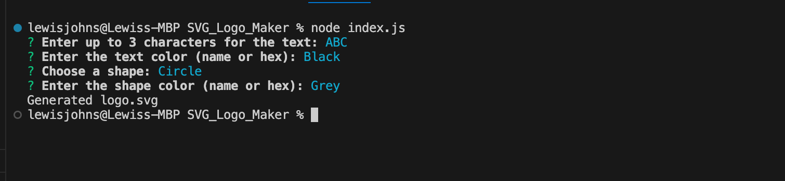
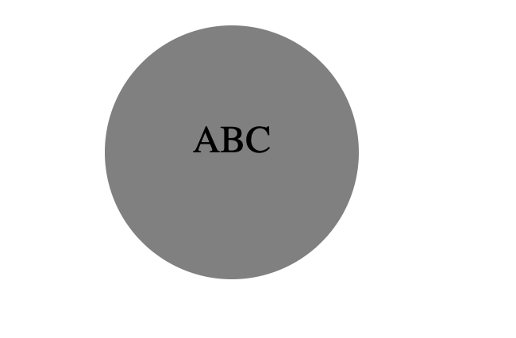

# SVG_Logo_Maker
This is a Node.js command-line application that takes in user input to generate a logo and saves it as an SVG file. The user is prompted to enter three letters, choose a shape from either a circle, triangle, or square, and choose the colour of the text and the colour of the shape.
https://github.com/lewisgjohns/SVG_Logo_Maker

